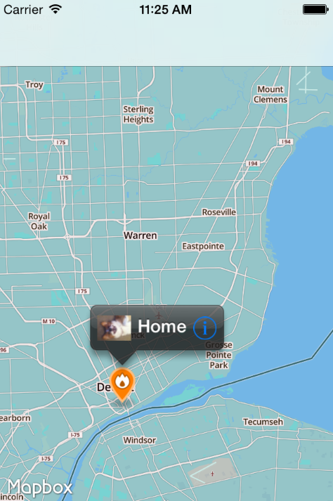
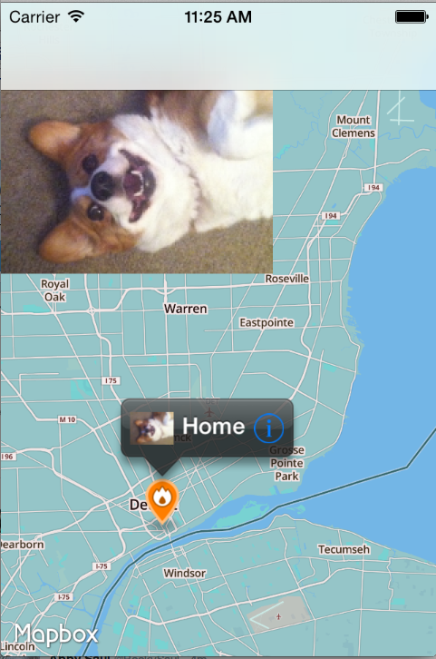

About
============
The beginnings of an app to guide people on a dinner tour. The place annotation features an image and tapping the info button brings up a large version of the image in the top left. I experimented with the Mapbox iOS SDK and did TDD with Kiwi.

Dependencies
============

Screenshots
============

